# NetSage AI: Proposed System Architecture
## Diagnostic Platform & Multi-Agent Consensus Verification Framework

This document outlines the proposed system architecture for **NetSage AI**, a hybrid network diagnostic and verification platform designed to bridge the gap between deterministic network rules and generative AI reasoning.

---

## 1. High-Level Architecture Overview

NetSage AI utilizes a **dual-tier analysis pipeline** coupled with an **AI Council Multi-Agent Consensus Debate Engine** to provide automated troubleshooting for Cisco Packet Tracer and enterprise-grade router/switch configurations. It enforces a strict **Human-in-the-Loop (HITL)** verification model to safeguard production network changes.

```mermaid
graph TD
    A[Cisco CLI Telemetry / Show Outputs] --> B[NetSage Web Dashboard]
    B --> C[Tier 1: Deterministic Engine]
    B --> D[Tier 2: AI Council Consensus Engine]
    
    subgraph Tier 1: Deterministic Analysis
        C --> C1[Regex Rule Validator]
        C1 --> C2[L1-L3 Structural Anomalies]
    end

    subgraph Tier 2: Generative Multi-Agent Debate
        D --> D1[Infrastructure Agent]
        D --> D2[Security Agent]
        D --> D3[Services Agent]
        D1 & D2 & D3 --> D4[Consensus Debate Engine]
        D4 --> D5[Consensus Diagnostic Verdict]
    end

    C2 & D5 --> E[Unified Review Workspace]
    E --> F[Human Engineer Verdict: Accept / Edit / Reject]
    
    F --> G[(JSON / CSV Persistence Store)]
    G --> H[Analytical Dashboard Charts]
    G --> I[Programmatic Excel Report Generator]
    
    style Tier 1: Deterministic Analysis fill:#1e293b,stroke:#3b82f6,stroke-width:2px;
    style Tier 2: Generative Multi-Agent Debate fill:#1e293b,stroke:#8b5cf6,stroke-width:2px;
    style F fill:#0f172a,stroke:#10b981,stroke-width:2px,stroke-dasharray: 5 5;
```

---

## 2. Component Descriptions

### 2.1 Telemetry & Data Ingestion Layer
* **Source Telemetry**: Configuration files and outputs from diagnostic CLI commands (e.g., `show running-config`, `show ip interface brief`, `show interfaces trunk`, `show standby brief`, `show access-lists`).
* **Ingestion Web Interface**: A responsive dashboard that routes diagnostic outputs to API controllers via asynchronous JSON requests.

### 2.2 Processing Layer: Dual-Tier Verification
#### Tier 1: Deterministic Heuristic Engine (`rule_checker.py`)
* Operates on a regular expression parsing engine to analyze static configuration properties.
* Swiftly identifies standard, deterministic Layer 1 to Layer 3 issues (e.g., administratively shutdown interfaces, subnet conflicts, interface IP configuration errors).
* Acts as an instantaneous, local pre-filter before calling high-latency language model processing loops.

#### Tier 2: AI Council Multi-Agent Consensus Engine (`app.py` & `static/app.js`)
To increase diagnostic reliability and eliminate singular LLM hallucinations, the platform splits generative reasoning among specialized agent profiles:
1. **Infrastructure Agent**: Analyzes hardware, interface configurations, and Layer 2 link-aggregation/trunk settings.
2. **Security Agent**: Focuses on access control lists (ACLs), wildcard masks, port security states, and firewall definitions.
3. **Services Agent**: Audits network application protocols, including DHCP scopes, DNS resolver settings, NTP time parameters, and HSRP high-availability configurations.

These agents conduct a simulated debate cycle, logging independent analysis outputs before submitting to a **Consensus Judge**, which reconciles disagreements into a final, actionable diagnosis.

### 2.3 Verification & Action Layer (Human-in-the-Loop)
* **Human Override Interface**: Displays the side-by-side findings of both the Deterministic Engine and the Generative AI Council.
* **Review States**: The operator must explicitly record a verdict:
  * **Accept**: Confirms the AI diagnosis and recommended fix commands are correct.
  * **Edit**: Allows the engineer to manually modify the CLI fix commands and root cause statements.
  * **Reject**: Flags the AI recommendation as invalid or incorrect.
* **Persistence System**: Reviews are stored immediately in local databases (`cases_db.json` and `cases.csv`).

### 2.4 Analytical & Presentation Layer
* **Web Portal**: Built using glassmorphism dark-mode aesthetics, integrating an **Interactive Canvas Topology Graph** that dynamically draws active network states and flags configuration anomalies in red.
* **Analytics Engine**: Parses the verification database to compute overall diagnostic success metrics, distribution of failures across OSI layers, and the ratio of AI validation vs. human edits.
* **Spreadsheet Compiler**: Dynamically generates a production-ready audit report (`dashboard.xlsx`) using the **XlsxWriter** library.

---

## 3. Technology Stack & Deployment Staging

### 3.1 Technology Stack
* **Frontend**: HTML5, Vanilla CSS3 (Custom Dark-themed Glassmorphism UI), Javascript (ES6), and **Chart.js** (for real-time metrics rendering).
* **Backend**: **Flask** (Python Web Framework) providing REST API endpoints.
* **Integrations**: Standard HTTP request handling (via Python standard library `urllib`) connecting to **Google Gemini API** (`gemini-1.5-flash`) for real-time AI diagnoses.
* **Reporting**: Programmatic spreadsheet generation using **XlsxWriter** and CSV libraries.

### 3.2 Deployment Architecture (Render Cloud Staging)
The application is pre-configured to build and run on a production-grade Web Service container like **Render.com**:
* **WSGI HTTP Server**: Utilizing **Gunicorn** to handle asynchronous connections.
* **Environment variables**: System secrets (such as `GEMINI_API_KEY`) are managed externally and injected during initialization to safeguard configuration keys.
* **Database State**: The application's persistence is file-based (JSON and CSV), optimizing it for stateless preview deployments and local engineering environments.
